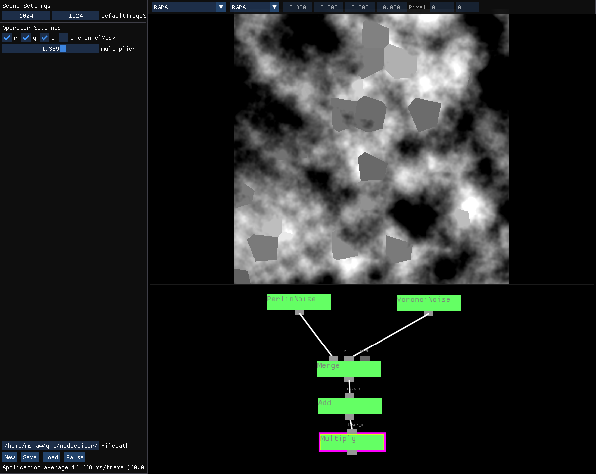

# Node Editor

2D image processing similar to the Foundry's Nuke. Intended for personal use to produce maps (might still contains references to "nodeeditor" as the original repo name).



# Building

It should be possible to just build with the following (Ubuntu):
```
git clone https://github.com/MattRickS/nodeeditor.git
cd nodeeditor
./build.sh
```

## External packages
External packages are fetched by cmake with FetchContent
- glm
- glew
- glfw
- ImGui

Also uses [stb](https://github.com/nothings/stb) for save/load of images.

## Dependencies
Requires the following packages to be first installed. The `build.sh` installs these (List might be out of date, untested from a new machine).

- libfreetype-dev
- libopenal-dev
- libvorbis-dev
- libflac-dev
